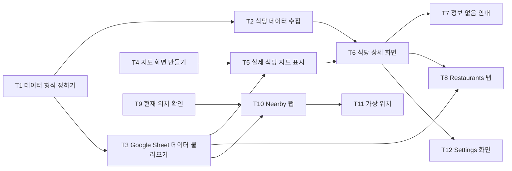

# 5주차 활동지 / Week 5 Worksheet

**1-page 기획서 / One-page plan**

- 작성일 / Date: 30일 9월
- 참여자 / Present: 아디브, 아이만, 아킬, 아마르

---

## ① 주제 확정 / Confirm topic

- 확정 주제 / Topic: Halal Hunter (HxH)
- 이유 / Reason: 안산에 거주하는 무슬림 학생들은 어떤 음식과 장소가 할랄(halal)인지 확인하는 데 어려움을 겪고 있습니다. 공식 인증을 받은 할랄 관련 정보가 거의 없기 때문에, 학생들은 주로 다른 학생들의 입소문이나 개인적인 경험에 의존하는데, 이는 종종 신뢰하기 어렵습니다. 

---

## ② 태스크 분해와 의존 관계 / Tasks and dependencies

앱 구조: **3개 화면**
1. 지도 화면 — 하단 탭: Restaurants / Nearby
2. 식당 상세 화면
3. Settings 화면

| # | 태스크 Task | 완료 조건 Done when | 선행 태스크 Depends on | 담당 Owner |
|---|---|---|---|---|
| T1 | [Must] 데이터 형식 정하기 | 식당명, 주소, 좌표, 추천 수와 음식명, 재료, 상태, 주문 조건의 필드가 정해진다. | 없음 | 아킬 |
| T2 | [Must] 식당 데이터 수집하기 | ERICA 주변 식당 10개 이상과 각 식당의 음식 1개 이상이 데이터 형식에 맞게 정리된다. | T1 | 아디브 |
| T3 | [Must] Google Sheet 데이터 불러오기 | 시스템이 Google Sheet에서 식당 데이터 1개 이상을 가져온다. | T1 | 아이만 |
| T4 | [Must] 지도 화면 만들기 | 지도에 더미 좌표를 사용한 식당 핀이 표시된다. | 없음 | 아마르 |
| T5 | [Must] 실제 식당을 지도에 표시하기 | Google Sheet의 식당이 실제 데이터로 지도에 핀으로 표시된다. | T3, T4 | 아마르 |
| T6 | [Must] 식당 상세 화면 만들기 | 식당을 선택하면 음식 상태, 주문 조건, 공식 할랄 인증이 아니라는 안내가 표시된다. | T2, T5 | 아디브 |
| T7 | [Must] 정보 없음 안내 만들기 | 음식 정보가 없으면 "정보를 확인할 수 없습니다"가 표시된다. | T6 | 아디브 |
| T8 | [Should] Restaurants 탭 만들기 | 식당이 추천 수가 높은 순서로 표시되고, 선택하면 상세 화면으로 이동한다. | T3, T6 | 아마르 |
| T9 | [Should] 현재 위치 확인하기 | 위치 권한을 허용하면 현재 좌표를 가져오고, 거부하면 안내 문구를 표시한다. | 없음 | 아킬 |
| T10 | [Should] Nearby 탭 만들기 | 현재 위치에서 100m 이내의 식당만 표시되고, 없으면 "100m 이내에 식당이 없습니다"를 표시한다. | T3, T9 | 아킬 |
| T11 | [Should] 가상 위치 기능 만들기 | 목록에서 위치를 선택하면 현재 위치로 사용되고 Nearby 목록이 변경된다. | T10 | 아이만 |
| T12 | [Should] Settings 화면 만들기 | Strict / Flexible을 변경하면 음식의 표시 여부가 변경된다. | T6 | 아이만 |

### 의존 관계 그래프 / Dependency graph (DAG)

---

## ③ 범위 결정 / Scope

### Must — 없으면 성립 안 됨 / essential

핵심 시나리오 1개가 끝까지 동작하는 데 필요한 것만 / *Only what the core scenario needs to work end-to-end*

핵심 시나리오 / Core scenario: 무슬림 유학생이 앱을 열면 → 지도에 ERICA 주변 식당 핀이 보이고 → 핀을 눌러 그 식당에서 먹을 수 있는 메뉴(right), 조건부로 먹을 수 있는 메뉴(예: 고기 빼기, 국물만)와 피해야 할 메뉴(X)를 확인한다. 정보가 없으면 "정보를 확인할 수 없습니다"가 표시된다.
모든 상세 화면에 "공식 할랄 인증이 아닙니다" 안내 문구 표시
대상 태스크: T1 ~ T7

### Should (없을 경우에는 작성하지 마세요)
 
- 식당 탭: 학생 추천 수가 많은 식당이 목록 맨 위에 표시된다 (추천 수는 팀이 수집한 초기 데이터 사용)
- 근처 탭: 사용자 위치 기준 100m 이내 식당만 표시된다 (시연용 가상 위치 포함)
- 설정 탭: 엄격 / 유연 모드 선택
- 화면 확대가 되고 글자 대비가 충분한 기본 접근성

### Could (없을 경우에는 작성하지 마세요)

- 학생이 추천 버튼을 눌러 추천 수를 올릴 수 있다
- 식당에서 직원에게 보여 줄 수 있는 한국어 주문 문구 (예: "고기 빼 주세요")
- 각 정보의 확인 근거와 최종 확인일 표시

### **Won't — 이번 학기에 안 함 / not this semester**

| Won't 항목 Item | 포기한 이유 Why |
|---|---|
|로그인 / 회원가입  | 핵심 시나리오에 필요 없고, 개인정보 수집 부담을 피하기 위해  |
|공식 할랄 인증 검증  | 커뮤니티 기반 서비스이며 인증 기관 연동은 범위를 넘음. 안내 문구로 대체  |
|리뷰·댓글 작성  | 운영과 검수 부담이 큼. 추천 수 하나로 대체  |
|사용자 위치 서버 저장  | 위치는 기기에서만 사용하고 저장하지 않아 개인정보 위험을 줄임  |
|길찾기 내비게이션  | 자체 구현 대신 외부 지도 앱 링크로 대체  |
|관리자 페이지  | 데이터는 구글 시트에서 직접 관리  |
|결제·주문·예약  | 서비스 목적과 무관  |
|ERICA·안산 외 지역  | 데이터 수집 범위 제한. 영향: 다른 지역 사용자는 사용할 수 없음  |
|전체 다국어 지원  | 영어 UI와 한국어 식당명 원문만 제공. 영향: 그 외 언어 사용자는 불편할 수 있어 이후 과제로 기록  |

### 실행 가능성 확인 / Feasibility check

- 특수 장비·유료 API·실제 개인정보가 필요한가? 필요하다면 대안은?
  - 특수 장비는 필요 없다.
  - 지도는 API 키가 필요 없는 Leaflet + OpenStreetMap을 우선 사용한다. Kakao 지도는 대안이며, 무료 할당량 조건은 사용 전에 확인한다.
  - 데이터는 팀이 직접 관리하는 구글 시트를 사용한다.
  - 위치는 브라우저 위치 기능(HTTPS와 사용자 허용 필요)을 사용하며, 기기에서만 쓰고 저장하거나 전송하지 않는다. 위치를 거부하면 가상 위치를 선택할 수 있다.
  - 로그인이 없어 개인정보를 수집하지 않는다.
  - 위험: 잘못된 할랄 정보를 주면 사용자에게 피해가 된다. 대안: 직원에게 직접 확인한 정보만 입력하고, "공식 인증이 아닙니다" 문구를 항상 표시한다.
15주차에 발표장에서 시연할 수 있는가? 가능하다. 웹 앱으로 배포한다. 발표장 100m 이내에는 식당이 없으므로 가상 위치 선택(T11)으로 근처 탭을 시연한다.

## ④ 가장 먼저 동작시킬 흐름 (Walking Skeleton) / First end-to-end flow

예 / Example: 과제 ID를 입력하면 → LMS에서 제출 기록을 받아 와서 → 화면에 제출 인원 숫자 하나가 뜬다

> [무엇을 입력하면] → [무엇을 처리해서] → [화면에 무엇이 나온다]
>
앱에서 '내 주변' 탭을 누르면 → 확인된 할랄 식당 중 현재 위치에서 1km 안에 있는 곳을 골라 거리순으로 정렬해서 → 화면에 식당 이름과 거리(m)가 뜬다

---

> 수업 종료 시 커밋하세요 / Commit this at the end of class
> `git add docs/week-05.md && git commit -m "docs: 5주차 활동지 작성"`
